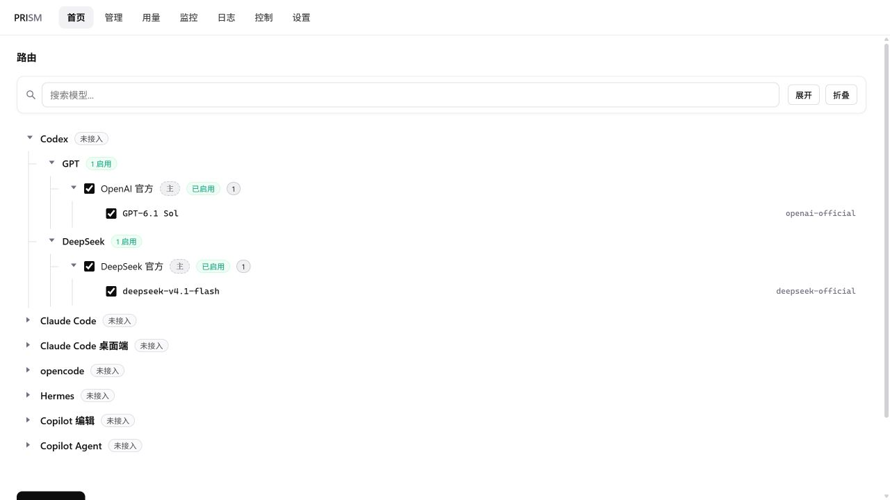

<p align="center"></p>

# Prism

**一个本地模型网关，管理多家来源，接入你的编码 Agent。**

面向 Windows AI 编程用户的桌面控制台：管理模型来源、路由和代理端接入，网关由 [CLIProxyAPI](https://github.com/router-for-me/CLIProxyAPI) 提供。

**[English](README.md)** · 中文

**[下载 Windows 版](https://github.com/glyahh/Agent-router-Pro-Max/releases/latest)** · [更新记录](https://github.com/glyahh/Agent-router-Pro-Max/releases) · [反馈问题](https://github.com/glyahh/Agent-router-Pro-Max/issues)



*当前真实界面，使用官方服务商名称与演示配置；不含个人账号、凭据或用量统计，不代表已完成实际接入。*

## 为什么用 Prism？

同时使用几家 AI 服务，不应该每换一次模型来源，就重新改一遍各个代理端的文件。

- **统一管理来源与模型：** 整理分组、编辑来源，选择暴露给代理端的模型。
- **区分同名模型：** 给不同来源设置渠道头，在代理端里分清同名模型来自哪一家服务商。
- **先预览，再接入：** 看清要改的字段再确认。接入前备份；断开时，只撤回仍保持 Prism 写入值的受管理字段。
- **控制网关、查看请求：** 在同一个界面里启停网关，查看请求图表、来源状态和日志。

已提供 **Codex、Claude Code、opencode、Hermes** 的配置接入适配。具体模型能否使用，取决于来源协议与代理端版本。Copilot 接入使用直连来源的配置，不经过本地网关。

## 开始使用

**运行环境：** Windows 10/11 x64，以及 [Microsoft Edge WebView2 Runtime](https://developer.microsoft.com/en-us/microsoft-edge/webview2/)。

1. 从[最新发布页](https://github.com/glyahh/Agent-router-Pro-Max/releases/latest)下载 Windows ZIP。
2. 完整解压到可写目录，保持 `Prism.exe`、`_internal/` 和 `cli-proxy-api.exe` 在一起，建议路径不带空格。
3. 双击 `Prism.exe`。
4. 用已有凭据添加来源，选择模型，保存路由。
5. 预览对应代理端的接入改动，确认后应用。如果模型列表没有刷新，重启代理端。

Prism 是控制台，不提供模型服务。你需要自行取得所选 AI 服务的使用权限，相关费用和额度限制仍由服务商决定。

## 同一个模型，两家来源

一家保持为主来源，另一家设置渠道头 `secondary`：

```text
主来源      GPT-6.1 Sol
另一来源    secondary/GPT-6.1 Sol
```

两个模型可以同时出现在代理端的模型列表里，由你明确选择来源；这不代表自动故障切换。

## 工作方式

Prism 使用 Python + WebView2，界面采用原生 HTML/CSS/JavaScript。它管理路由和接入，**推理请求由 CLIProxyAPI 转发**，不经过控制台的 HTTP 服务。默认本地端口：网关 `8317`，控制台 `8318`。

凭据保存在本机的 `config.yaml`、`.local-secrets.json` 等文件中。不要分享这些文件或含凭据的备份；分享截图和日志前，遮住凭据、账号及私有端点。

## 反馈与贡献

可以[提交 Issue](https://github.com/glyahh/Agent-router-Pro-Max/issues)，附上 Prism 版本、Windows 版本、代理端、复现步骤，以及预期和实际结果。截图或日志请先脱敏。

欢迎提交范围清晰的修复。较大的功能变更，请先在 Issue 里讨论方案。

## 许可与致谢

Prism 采用 [MIT 许可](LICENSE)。随包分发的网关来自独立上游项目 [CLIProxyAPI](https://github.com/router-for-me/CLIProxyAPI)。第三方组件保留各自的许可，详见[第三方组件声明](THIRD-PARTY-NOTICES.md)。
